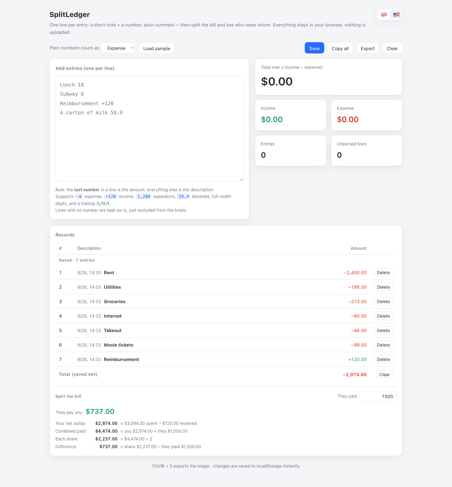

# SplitLedger · 记账分摊

[简体中文](README.md) | **English**


> One line, one number, one entry. Amounts are parsed automatically, totals update live, and splitting the bill tells you exactly who owes whom.



**[Use it online](https://splitledger.app.workbuddy.host/)**

---

## What it is

A tiny **expense tracker with bill splitting**. No sign-up, no login, no upload — your data lives only in your browser's `localStorage`.

The web app is a **single file** (`web/index.html`, HTML / CSS / JS all inlined): zero dependencies, zero build, zero backend. Double-click it and it runs, or drop it on any static host.

## Features

- **Write it like a message** — one entry per line: `Lunch 18`, `Taxi 23.5`, `Reimbursement +120`
- **Smart parsing** — the **last number** on a line is the amount, the rest becomes the description. Supports `-6` expense, `+120` income, `1,200` separators, `59.9` decimals, full-width digits, and a trailing 元 / 块 / ¥
- **Nothing is thrown away** — lines without a number are kept and marked "not counted" instead of being silently dropped
- **Live stats** — total (net = income − expense), income, expense, entry count, unparsed lines
- **Save & records** — split the editor into individual records in one click (newest batch first); delete single records or clear them all
- **Split the bill** — type what *they* paid and see who owes whom, with the whole calculation laid out
- **Two exports** — long image (`⌘/Ctrl + S` or the menu) and CSV
- **Bilingual UI** — switch between Chinese and English (🇨🇳 / 🇺🇸); the currency symbol follows the language (`¥` / `$`)
- **Follows your system dark mode**, responsive layout (breakpoints at 600px / 860px)

## Quick start

### Use it online

Click **[Use it online](https://splitledger.app.workbuddy.host/)** to open it — no install, no sign-up.

### Run it locally

There is no build step — open the file directly:

```bash
# Option 1: open the file (macOS)
open web/index.html

# Option 2: serve it locally
cd web && python3 -m http.server 8080
# then visit http://localhost:8080
```

## Parsing rules

The **last number** on each line is the amount. A `+` means income, a `-` means expense, and **unsigned numbers** follow the "Plain numbers count as" setting in the toolbar (expense by default).

| You type                 | Parsed as        | Notes                                  |
| ------------------------ | ---------------- | -------------------------------------- |
| `Lunch 18`               | expense $18.00   | Unsigned — follows the toolbar setting |
| `Taxi 23.5`              | expense $23.50   | Decimals supported                     |
| `Reimbursement +120`     | income $120.00   | Leading `+` means income               |
| `Client payment +1,200`  | income $1,200.00 | Thousand separators supported          |
| `Groceries １２`           | expense $12.00   | Full-width digits supported            |
| `Milk 59.9 元`            | expense $59.90   | A trailing 元 / 块 / ¥ is ignored        |
| `Forgot my wallet today` | —                | No number: kept, marked "not counted"  |

## UI reference

| Where           | Element                  | What it does                                                             |
| --------------- | ------------------------ | ------------------------------------------------------------------------ |
| Top right       | 🇨🇳 / 🇺🇸              | Switch Chinese / English (currency follows)                              |
| Toolbar         | "Plain numbers count as" | Whether unsigned numbers are expenses or income                          |
| Toolbar         | Load sample              | Fills the editor with sample lines                                       |
| Toolbar         | Save                     | Splits the editor into records, stores them locally, clears the editor   |
| Toolbar         | Copy all                 | Copies the whole editor text to the clipboard                            |
| Toolbar         | Export → Export image    | Exports the full ledger as one long image (totals + bill split included) |
| Toolbar         | Export → Export CSV      | Exports CSV (UTF-8 with BOM, opens cleanly in Excel)                     |
| Toolbar         | Clear                    | Clears the editor (with confirmation)                                    |
| Records table   | Total row                | Net total of saved records + clear saved (with confirmation)             |
| Below the table | Split the bill           | Enter what "they" paid to see the difference and the full maths          |

### Keyboard shortcuts

| Shortcut     | Action                                                                 |
| ------------ | ---------------------------------------------------------------------- |
| `⌘/Ctrl + S` | Export the image directly (CSV is only reachable from the Export menu) |
| `Esc`        | Close the Export menu and return focus to the button                   |

## How the bill split works

The assumption is: **the ledger records what *you* paid, and you type in what *they* paid. Both are treated as shared spending, then split 50/50.**

```
Your net outlay  mine  = expense − income
Combined paid    total = mine + they paid
Each share       each  = total ÷ 2
Difference       diff  = each − they paid     (always (mine − they paid) ÷ 2)
```

- `diff > 0` → **They pay you** (green)
- `diff < 0` → **You pay them** (red)
- `they paid == your net outlay` → **All settled**, shown as text without an amount (a difference below 0.005 counts as settled, to avoid floating-point noise)

## Data & privacy

- Everything stays in your browser. No upload, no network calls, no account. Switching browsers or clearing your cache means starting a new ledger.
- Storage locations (`localStorage`):

| Key                    | Contents                                                                |
| ---------------------- | ----------------------------------------------------------------------- |
| `ledger-mini/v1`       | Draft: editor text, direction setting, language, the "they paid" amount |
| `ledger-mini/saved/v1` | Saved records, each `{at, label, amount, dir}`                          |

> The `ledger-mini` key prefix is kept **on purpose** — changing it would wipe the ledgers of every existing user.

## Project layout

```
splitledger/
├── web/
│   └── index.html              # Single-file app (HTML/CSS/JS inlined)
├── docs/
│   ├── screenshot.png          # Chinese UI
│   └── screenshot-en.png       # English UI
├── README.md                   # Chinese docs (default)
├── README.en.md                # English docs
└── LICENSE                     # MIT license
```

## Development notes

- The web app has **no build and no dependencies**: edit `web/index.html` and refresh the browser.
- Both language tables live in the same `I18N` object (`zh` / `en`); the two key sets must stay **strictly aligned**, so update both when you change wording.
- The exported long image renders at most 200 detail rows; beyond that it appends "…and N more not shown".

## Browser support

Modern Chrome / Edge / Safari / Firefox. The long-image export uses Canvas and downsamples to stay under iOS Safari's canvas area limit; if the export fails it tells you to try another browser.

## License

[MIT](LICENSE) © 2026 kingsir
